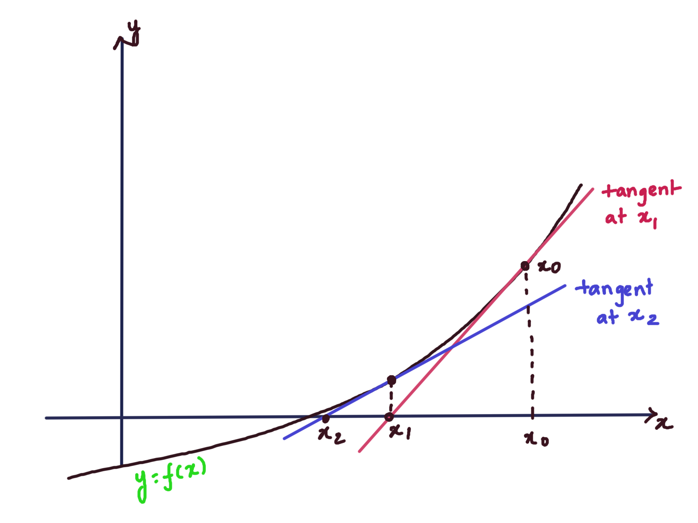
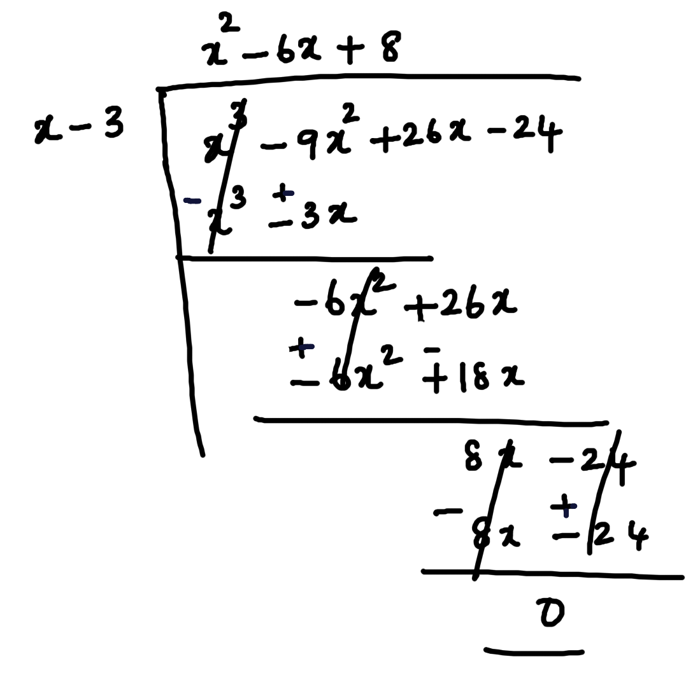
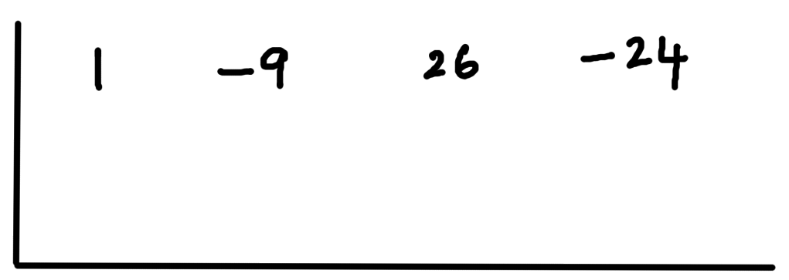
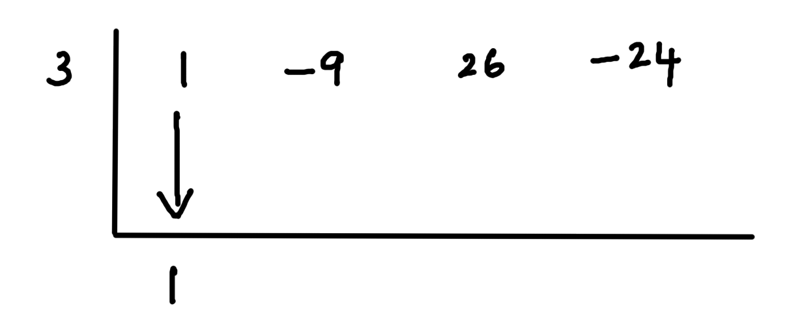
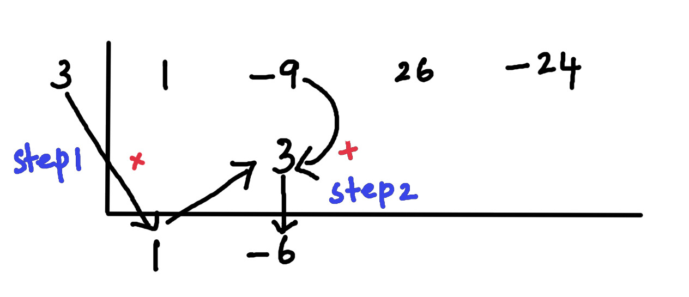
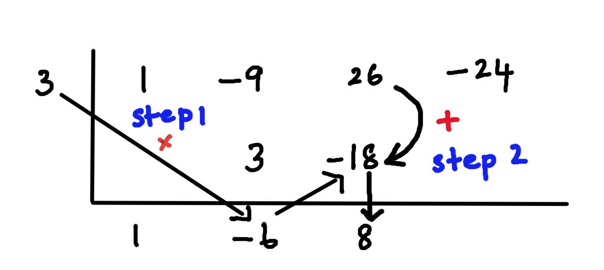
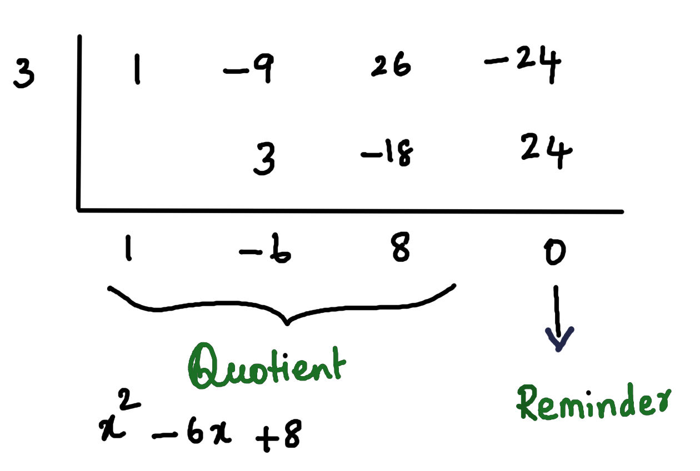

# Find roots of a polynomial of any degree

## Problem Statement

This writeup explains how to solve a polynomial equation of any degree. 

We do not have any predefined formula to solve a polynomial of degree more than 3. Numerical methods are mathematical tools that can be used to find the approximate roots of a polynomial. 

So, we are basically implementing an algorithm that combines a numerical method and synthetic division to solve a polynomial equation.

Our implementation takes a list of coefficients of a polynomial as input and gives all roots of it.

We can make use of the Bisection method to find a root of a polynomial. But we haven't used the Bisection method in this problem. Before discussing why let's first look into what is the Bisection method.

## Bisection method

Given a function $f(x)$ and two numbers ‘$a$’ and '$b$'

*Assumptions:*

1. $f(x)$ is continuous in between the interval $(a,b)$
2. And $f(a)\times f(b)<0$

*Solution:*

1. Find middle point of '$a$' and '$b$', say $c$
2. If $f(c)=0$, then $c$ is the root
3. Else:
   1. If $f(a)*f(c) < 0$ then root lies in between $(a, c)$. Repeat the steps with the new interval $(a, c)$
   2. Else $f(b)*f(c) < 0$ then root lies in between $(b, c)$. Repeat the steps with the new interval $(b, c)$

### Advantages

We know how close we are to the solution since we are repeating the procedure with the interval which becomes smaller and smaller bringing us closer to the solution.

### Disadvantages

The disadvantage of using the Bisection method is that we cannot find multiple roots of a polynomial.

Another major disadvantage is finding the intervals  $(a,b)$. The intervals have to be somewhat closer to the root. Most importantly, only one root should fall in that interval. For example,  if we are giving a large interval and if there are more than one root fall in the same interval, the algorithm halts. 

Hence we need a better algorithm to solve this efficiently. 

## Newton's Method

As the Bisection method doesn't suit us, we make use of Newton's method to find out one of the roots of any given polynomial.

There are other Numerical methods like the Secant method to find a root of a polynomial. But, the Newtons method is comparatively easier and does not require more inputs.

Now let us discuss what is Newton's method

Suppose we wanted to find the solution of a function $f(x)$ (a polynomial function of any degree in this case), and suppose we find an initial guess to this solution, say $x_0$. This initial guess is almost always bad and so we wanted to find a better approximation. This can be done by drawing a tangent line of $f(x)$ at $x_0$.

The equation of the tangent line at $x_0$ is:

$$y = f(x_0) + f′(x_0) (x−x_0)$$	

Below is the graph showing the tangent line 

We can see that the tangent line at $x_0$ is much closer to the solution. Let's call this new point as $x_1$ (which is our new approximation)

Now we know the coordinate of the new approximation. i.e., $(x_1, 0)$. We substitute this value in our original equation and evaluate $x_1$ as follows:

$$0 = f(x_0) + f′(x_0) (x_1−x_0)$$

$$x_1−x_0 = − f(x_0) / f′(x_0)$$

$$x_1 = x_0 − f(x_0) / f′(x_0)$$

Hence, we can find the solution, as long as $f'(x_0) \ne 0$.

Now we repeat this procedure again to find the better approximation to $x_1$ as follows. Lets say the next approximation is $x_2$. We calculate $x_2$ as follows

$$x_2 = x_1 − f(x_1) / f′(x_1)$$

Newton's method is, given a function $f(x)=0$, and $x_n$ is an approximation of $f(x)$ and $f'(x) \ne 0$ , then the next approximation is calucated as:

$$x_{n+1} = x_n − f(x_n) / f′(x_n)$$

Using Newton's method, we find one root of a given equation. Newton’s method is iterative in nature. It runs in a loop inching closer and closer to the most optimal solution.

The disadvantage of using Newton's method is 

1. $f'(x)$ should not be zero and
2. We need to find the initial approximation ($x_0$) somehow
3. We need to find the derivative of $f(x)$ for each approximation

Now let's see how we make use of Newton's method in this problem.

1. The input function (basically a list of coefficients), is converted into a symbolic expression using the function *sybolic_fn()*. 

2. The symbolic expression is evaluated using *evaluate_sym_exp()*.
3. The *newtons_method()* function is an implementation of Newton's method which outputs a root of the symbolic expression. We are using *sympy* to find the first derivative of $f(x)$

Now, we have an equation and one root of it.

4. Using Newton's method, we find a root of $x$ say $x=5$. We are converting this root into a factor, $x-5$ (to do synthetic division).

5. Using the factor from the step above, we can reduce a $n$-degree polynomial to an $n-1$ degree by making use of synthetic division.

What is synthetic division?

## Synthetic Division

Synthetic Division is a method of polynomial division. In this case, we are using synthetic division to reduce the degree of a polynomial by one degree each time, with the roots we get from Newton's method.

Let's take an example polynomial of three degrees to explain how synthetic division works:

$$x^3-9x^2+26x-24$$

Let us assume, our Newton's method identifies 3 as one of the roots of this polynomial

The general division of the polynomial is as follows:

Now, let's see how synthetic division works for the same example:

First, we have to take all coefficients of the polynomial and write it inside a "L" shaped division symbol:

Put the factor $3$ at the left side

Take the first coefficient (leading coefficient) out unchanged.

Now multiply this carry down value with the factor 3 and put the result in the next column (inside the division symbol). Now add the column and put the sum at the bottom of the division symbol.

Now multiply the previous carry down value with the factor to get the next value.

Repeat this until we reach the last number.

If the value of the last column is 0, then x-3 is a factor of this polynomial. i.e., 3 is in fact the root of this polynomial.

The quotient value will be $x^2-6x+8$ (which is one degree less than the actual polynomial)

Now we give this polynomial of $(n-1=2)$ second degree as an input to Newton's method to get one root of this equation.

We repeat synthetic division for the new second degree polynomial with the root given by Newton's method, to get a polynomial of lower degree.

We repeat this until we get all roots of the polynomial.

## tools used to solve this problem

1. Matplotlib: For Visualization of the polynomial with the solutions
2. Sympy: To get the first derivative of a function to implement Newton's method. We can remove the dependency of Sympy by making use of *Finite Difference Method*. 
3. Numpy 
4. Krita for drawing
5. Typora for editing markdown

## How to contribute

This project can be extended to solve equations with non-linear terms like sine, cosine, and exponential, by making use of Taylor series expansion.

 

